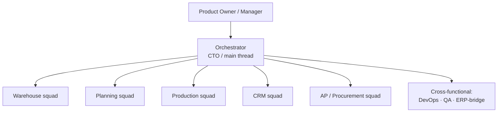
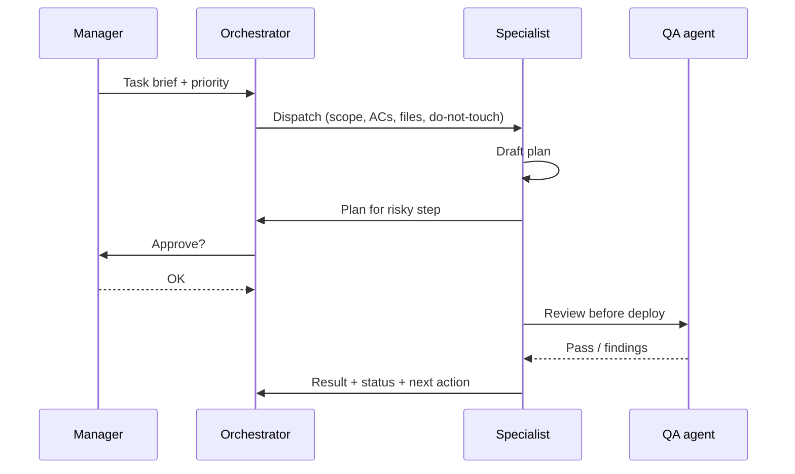

> **TL;DR** — [Part 1]() argued a solo manager can run a squad of AI agents. This is the wiring diagram: how the squad is structured, why agents run on different model tiers, and the protocol that keeps them from stepping on each other. The core idea: **an AI squad is an org-design problem, not a prompting problem.**

---

_One orchestrator, model-tiered squads, a strict protocol — context in, status plus next action out._

The quality of your output is set by how you decompose and route work — not by how clever any single prompt is.

---

## The org chart

There is exactly one **orchestrator** (the "main thread") and a set of **specialist agents**, each scoped to one system or function. The orchestrator never does deep domain work when a specialist exists — its job is triage, decomposition, and routing.

Each specialist owns one codebase or domain. The orchestrator owns the *map* — who's responsible for what, and who must talk to whom before acting (anything touching the ERP goes through the ERP-bridge agent; anything shipping to production goes through QA first).

---

## Why agents run on different model tiers

Running every agent on your biggest model is like staffing every role with a principal engineer: expensive and, oddly, *worse*. Tier deliberately:

| Tier | Use for | Why |
|---|---|---|
| **Strong reasoning model** | Orchestration, architecture, integration design, QA review | A wrong decision here is expensive; reasoning depth pays off |
| **Fast / cheaper model** | Routine ops, CRUD-y squads, automation, infra chores | High-volume, well-specified work where speed and cost matter more |

The point isn't "cheap = bad." It's **matching the model to the cost-of-being-wrong**. A docs or automation task on a fast model finishes sooner and frees the expensive model for decisions that actually need it.

---

## The dispatch protocol

Agents don't share a brain. They coordinate through an explicit, deliberately boring protocol — and most of the reliability comes from it being strict:

1. **Dispatch carries full context** — scope, acceptance criteria, the files it may touch, and explicitly *what it must not touch*. A vague brief produces a vague (sometimes destructive) result.
2. **Propose before executing anything risky** — for irreversible or production-facing work, the agent drafts a plan and waits for a human OK. "Go ahead" on one task is not a blanket license for the next.
3. **Results flow back as status + next action**, so the orchestrator keeps the map current and routes the follow-up.
4. **A shared state file** records system status and a session log, so a fresh agent session starts from reality, not amnesia.

---

## A curated memory, not a chat log

Agents forget between sessions, and raw transcripts are useless for recall. Keep a **curated wiki** — one page per entity (each system, each squad, each collaborator) and per concept, in the spirit of a personal "LLM wiki":

- **Query the wiki first.** If the answer's there, cite the page.
- **Fall back to raw sources** only when the wiki is missing or stale — and *fix the wiki as a side effect*.
- **Ingest** every significant decision into a dated source note plus the entity pages it affects.

This is the difference between an assistant that re-derives context every morning and one that compounds knowledge.

---

## Guardrails that earned their place

Every one of these came from an incident, not a whiteboard:

- **An agent cannot grant itself permissions.** Elevation is a human action, every time.
- **Never weaken auth "to make it work."** A blocked deploy is cheaper than a silent security hole.
- **No secrets in shared logs or chat.** A leaked password in a persistent log is leaked forever — redact at the source.
- **Conditional boundaries stay in force** even after a "do it" — a step gated on "after X is verified" is still gated.
- **Stop scope-creep:** if you've re-briefed a task three times and nothing shipped, freeze the plan and lock one target.

---

## The honest takeaway

An AI squad multiplies a manager's reach — but it multiplies *intent*, including sloppy intent. The wins came from org design (clear ownership), routing (right model for the cost-of-wrong), and protocol (full-context dispatch, propose-before-risky, verify-then-trust). The prompts were the easy part.

---
*Part 3 will cover the QA-before-human-smoke-test deploy ladder in detail.*
