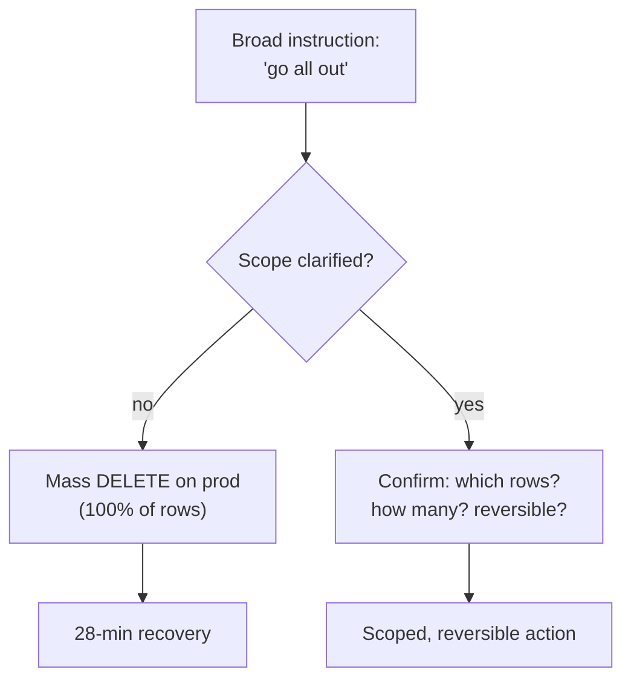

> **TL;DR** — The RCA discipline from the [Buck LED Driver RCA]() works just as well on a production data incident. Same failure mode every time: people propose a fix before they understand the symptom. Three sanitized incidents, one portable checklist.

---

_Gather symptoms, distrust the convenient hypothesis, verify the end state — before you touch the keyboard._

In hardware RCA the rule is simple: **gather symptoms before forming a hypothesis.** Measure before you replace the diode. Software incidents are no different — except the urge to "just try a fix" is stronger, because a code change *feels* free. It isn't.

---

## Case 1 — The phantom stock cut of −648 pieces

**Symptom:** one item showed a goods-issue of −648 pcs that no operator had entered. On-hand was suddenly wrong by exactly that amount.

Half the room said "it's the feature we shipped this week — roll it back." That's a hypothesis dressed up as a fact. We gathered symptoms first:

- *When* did the movement appear? (timestamp)
- *Who/what* was the actor on the record? (not a logged-in user)
- Is it reproducible from any UI action? (no)

The audit trail pointed not at the new feature but at a **one-off maintenance script** run with an `--apply` flag against the wrong input file. The feature was innocent. The fix was a corrective `+648` movement **with an audit note** — never a silent edit — plus deleting the script so it could never run again.

> If we'd "rolled back the feature" on the first hypothesis, we'd have shipped a *second* incident and still had the −648 sitting there.
{: .prompt-warning }

- **Root cause:** an ad-hoc script with production write access and no dry-run guard.
- **Lesson:** the cheapest fix to *imagine* is rarely the cause. Let the timestamp and the actor field tell you who really did it.

---

## Case 2 — "Just go all out" deleted a table

**Symptom:** two tables — inspection records and inventory IDs — went to zero on production. Recovery took the team ~28 minutes of coordinated work.

The trigger wasn't a bug. It was a **vague instruction** — "go all out / handle it completely" — interpreted as license to run a mass `DELETE`/`sync` across 100% of rows.

- **Root cause:** a destructive action on an ambiguous scope, with no "how many rows will this touch?" pre-check.
- **Lesson:** a broad direction is *not* a scope. Before any mass mutation, state the blast radius out loud — *"this touches N rows, here's the snapshot, here's the undo"* — and confirm. Same discipline as LOTO before you energize a board.

---

## Case 3 — The migration that "succeeded" but did nothing

**Symptom:** a new column was missing in production even though the deploy log clearly read `Running upgrade abc → def`. No error anywhere.

The most dangerous class of incident: the **silent failure**. The system reported success while doing nothing. Two real culprits we've hit:

- A new data model file was never registered in the package's `__init__`, so the migration tool saw "no changes to make" and happily printed success.
- A required environment variable wasn't passed into the container, so a sync logged `BLOCKED` (not `FAILED`) and no alarm ever fired. It stayed broken, quietly, for 16 days.

> `BLOCKED` and `FAILED` are not the same word — but your monitoring needs to treat them the same. A failure that pages nobody is a failure that lives for two weeks.
{: .prompt-danger }

- **Root cause:** success was *assumed* from a log line, never *verified* against the actual end state.
- **Lesson:** never trust "it said it worked." After a migration, query the target table. After a sync, count the rows that moved. A green log is a claim, not evidence.

---

## The portable checklist

Whether the failed thing is a buck converter or a database, the loop is the same:

1. **Capture symptoms first** — timestamps, actor/source, reproducibility — *before* proposing a cause.
2. **Distrust the convenient hypothesis** — "it's the new feature" is just the thing you touched most recently, not the cause.
3. **Verify the end state, not the log** — count rows, read the table, re-measure the voltage.
4. **Make the fix auditable** — a corrective movement with a note beats a silent edit you can't explain next quarter.
5. **State the blast radius before destructive actions** — N rows, snapshot taken, undo ready.

RCA isn't a hardware skill or a software skill. It's the refusal to guess before you've looked.
