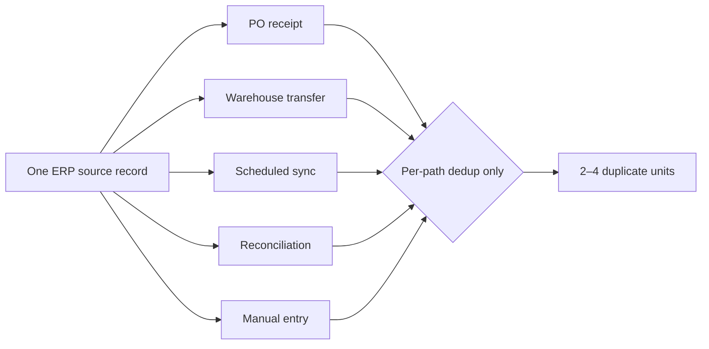
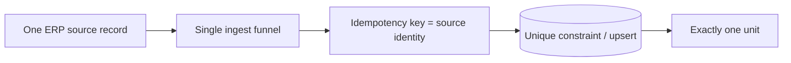

> **TL;DR** — When the same upstream record can enter your system through several importers, a per-importer "have I seen this?" guard isn't enough. The same source record sneaks in 2–4 times through different doors. Idempotency must key on the **source record's identity**, enforced across **every** path — not per path.

---

## The over-count nobody owned

An operational system was over-counting inventory versus the ERP. Each importer, reviewed in isolation, looked correct. The bug was structural.

One physical receipt of goods could be imported by **five** different code paths:

- a purchase-order receipt,
- a warehouse transfer,
- a scheduled ERP sync,
- a reconciliation job,
- and a manual entry.

Each path had its own idempotency check — scoped to *itself*. Path A's guard never knew Path B had already imported the same goods. So one source record landed as 2–4 duplicate units, and the inventory quietly inflated.

---

## "Measured completely" ≠ "root-caused completely"

The team had carefully verified each importer's own dedup logic and declared the area covered. But **"every path dedupes itself" is not "the system dedupes."** The duplicate only appears at the *intersection* of two paths — which no single path's tests exercise. The number of failure-pairs grows quadratically with the number of paths; the number of people thinking about the intersection stays at zero.

> Verifying each component in isolation can prove every part correct and still leave the *system* wrong. Cross-path behavior is its own thing to test.
{: .prompt-warning }

---

## The fix — one identity, one door

- **Derive the key from the source system's record identity** — its stable natural key — not from anything local to the importer. The key must be *identical* whether the record arrives via PO, transfer, sync, reconciliation, or manual entry.
- **Funnel every path through a single ingest function** that enforces an upsert on that key. A new door added next quarter goes through the same gate for free.
- **Back it with a unique index.** Even if a future path forgets the check, the database refuses the duplicate instead of silently inflating a balance. The safe path becomes the *only* path.

---

## Why per-path guards feel safe but aren't

Each path is written at a different time by a different person, and each adds a reasonable-looking "skip if already imported" against *its own* table or marker. Locally, every one is correct. The defect lives only where two paths overlap — and that overlap belongs to no single author, no single test, no single review. It is precisely the kind of bug that survives because everyone who could see it is looking one path over.

---

## This isn't just inventory

The same shape shows up everywhere two producers can describe the same fact:

- **Payments** — a charge imported by a webhook *and* by a nightly reconciliation.
- **Tickets** — created from an inbound email *and* from the API.
- **Events** — handled by a retry *and* by the original delivery.

Same fix every time: **idempotency keyed on the producer's identity, enforced centrally.**

---

## The portable checklist

- **Count the doors.** List every path that can create the same logical record. More than one → you need cross-path idempotency.
- **Key on the source's identity, not the transport.** The key must not depend on which importer ran.
- **One ingest funnel + one unique constraint.** Make the safe path the only path.
- **Test the intersection.** "Each path is correct" is not a system property — fire two paths at the same source record and assert one row.

---

## Related Posts

- [Is the Number Wrong, or Is the Stock Gone?]() — cross-path duplicates are a classic source of phantom "drift"
- [Financial Core vs Operational Core]() — the architecture that makes multiple import paths exist at all
