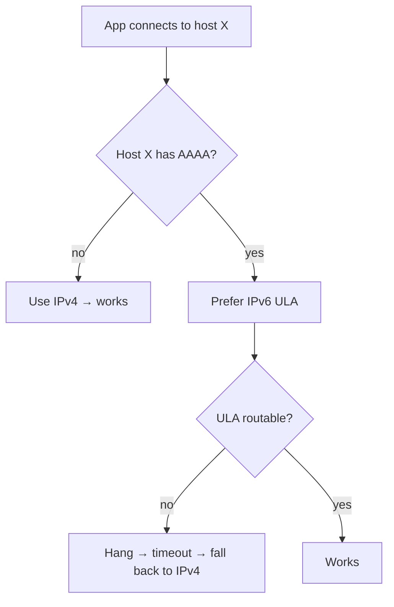

> **TL;DR** — Three production "outages" where nothing was actually down: a small server refusing *bursts* of connections (not single ones), a host quietly preferring an unroutable IPv6, and a service that silently core-dumped on restart after a host upgrade. Every one was first misdiagnosed as "the other system is down." The portable lesson — when something looks dead, prove *where* it's dead before you escalate.

---

The same discipline from the [Buck LED Driver RCA]() applies to infrastructure: **measure before you replace the diode.** "The integration is broken" is a symptom, not a diagnosis. In all three of these, the loud assumption ("the upstream is down") was wrong, and the real cause was on our side of the wire.

---

## Case 1 — "Connection refused" on bulk reads — but a single read works fine

**Symptom:** pulling 50–200 records at a time from the ERP failed with `Connection refused`, and it always died around the same offset (~1000 rows in). Yet a single-record health probe passed 8 times out of 8.

The reflex: "the ERP is down" (or "it's an IPv6 thing"). Both wrong.

The ERP ran on a small VPS with a finite worker/connection pool. One light request fits easily. A *burst* of parallel reads — made worse because several scheduler jobs each opened their own connection window on overlapping cron minutes, so ~5 conversations hit a box sized for ~2 — exhausted the pool, and the OS started refusing new TCP connections. The server process never crashed. It was *busy*, not *dead*.

> A health probe that passes tells you one request fits. It says nothing about whether your *workload* fits. Test at real concurrency.
{: .prompt-warning }

Two fixes, both on our side:

- **Consolidate the bursts.** Four independent schedulers were each opening their own window. We put them behind a single shared gate (one semaphore) so total concurrency against the ERP never exceeded what the box could serve.
- **Pull gently.** A fresh client per window, a bounded window size, a `search_count` up front so paging is deterministic, offset stepping by the window width, and retry-with-backoff on a refused connection. And crucially: a **partial read is not a smaller truth** — treat the pull as all-or-nothing, because a half-finished read looks exactly like real data loss to everything downstream.

**Diagnostic tell:** light probe passes, burst fails, fails at roughly the *same offset* every time → that's a **limit**, not an **outage**.

---

## Case 2 — The network was "flaky" — IPv6 was

**Symptom:** deploys and container-registry pulls from one host became intermittently slow (5+ seconds) or hung, then recovered. Other hosts on the same LAN were fine. The ERP integration — which talks to an IPv4-only host — was *never* affected.

The reflex: "the ISP / the network is flaky." But flakiness that's **selective** is a clue, not noise.

The host had joined a mesh VPN, which handed it a *global-scope* IPv6 address in the ULA range (`fd7a:…`). Linux address selection (RFC 6724 / `getaddrinfo`) now believed the host had working global IPv6, so for any destination publishing an `AAAA` record it tried IPv6 **first**. That ULA had no route to the public internet → the connection hung until it timed out and fell back to IPv4. Dual-stack hosts (the registry, code hosting) intermittently hit this; the IPv4-only ERP host has no `AAAA`, so it was immune — which is *exactly* why only some things broke.

**Fix:** pin address precedence so mapped-IPv4 outranks the ULA — `precedence ::ffff:0:0/96 100` in `/etc/gai.conf`. Egress now prefers IPv4 and the hangs stopped.

**Diagnostic tell:** the "flaky" set is *per-destination*. The hosts that break all have `AAAA` records; the ones that work are IPv4-only.

---

## Case 3 — The service that wouldn't restart — and it wasn't the data

**Symptom:** after a routine restart, a service refused to come back. No stack trace. The process exited **139** the moment it opened its embedded database. HTTP probes returned nothing. The log was silent.

The reflex: "the database is corrupt / the service is dead."

A compiled native addon (a SQLite binding) had been built against the *old* runtime ABI. The host's runtime was upgraded underneath it. On the next restart, the addon's binary no longer matched the runtime's C++ ABI, so the very first native call segfaulted **before any application log line could run**. Nothing was corrupt — the *binary* was incompatible with the *runtime*.

> Exit code **139** is `128 + SIGSEGV(11)`. Silence + a segfault + "it worked until the restart" + a recent runtime upgrade = an **ABI mismatch**, not data loss.
{: .prompt-danger }

**Fix:** rebuild the native module against the current runtime (`npm rebuild <addon>`); add "rebuild native addons" as a standard step in any host-runtime upgrade; and rebuild *before* restarting other services that share the same host and the same addon.

---

## The portable checklist

- **Localize before you escalate.** Which leg is dead — yours, the network, or theirs? Don't page the vendor until you know.
- **A passing probe is not a passing workload.** Reproduce at the real concurrency and the real batch size.
- **Selective flakiness is a clue.** Find what the broken cases share (an `AAAA` record, an offset, a code path).
- **Exit 139 / silent death right after a deploy or host change** → suspect a binary/ABI mismatch, not your data.
- **A partial success is not a small truth.** Bulk reads are all-or-nothing; a half-read invents losses that aren't there.

---

## Related Posts

- [RCA for Software — Gather Symptoms Before You Touch the Keyboard]() — the same "symptoms first" discipline on data incidents
- [Financial Core vs Operational Core]() — why the ERP and the operational systems talk over a wire in the first place
