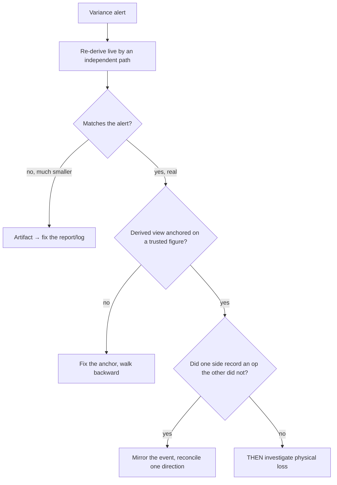

> **TL;DR** — A reconciliation alert measures your *records*, not your *reality*. Before you act on a variance, re-derive it live by an independent path. Three times a scary inventory "drift" turned out to be a measurement artifact, not missing stock — and the one time it was real, the stock still wasn't lost.

---

_A reconciliation alert measures your records, not your reality — rule out three cheaper explanations before you panic._

When two systems disagree about how much stock exists, the word "drift" gets thrown around as if it means one thing. It doesn't. Four different statements get collapsed into "the stock is wrong":

1. The **reported number** is wrong — the alert, log, or cached column is stale or double-counts.
2. The **derived view** is wrong — the ledger recompute starts from a bad anchor.
3. The **records disagree** but the **physical stock is fine** — one system did an operation the other never recorded.
4. The **stock is actually missing** — the only one that deserves the word "loss."

You earn the right to claim #4 only after ruling out #1–#3. Here is each, from real incidents (sanitized).

---

## Case 1 — The alert log that cried wolf (~60% phantom)

**Symptom:** a "drift" dashboard showed ~1.8M units of variance. Panic in the room.

We re-derived it live — computed the drift fresh against the other system — and got ~233 items / ~628K units, with a 5-of-5 spot-check matching to the unit. So **most of the headline number was never real.**

Why the log lied: it was an **accumulator**. Every run *appended* alert rows; a 24-hour dedup window suppressed repeats but never *resolved* the ones that had since been fixed; and a chunk of rows were left over from a stale snapshot era. The log grew monotonically and nothing ever subtracted. It measured *"how many times we have ever worried,"* not *"how wrong we are right now."*

> An append-only alert log is not a metric. If nothing ever closes a row, its length only goes up — and "the number keeps rising" reads as "the problem keeps growing" when it's really "we keep remembering."
{: .prompt-warning }

**Fix:** resolve and close rows when the underlying variance clears; compute the headline figure from a **live query**, not from the length of a log.

---

## Case 2 — The running-balance column that was born wrong

**Symptom:** a stock-card view showed impossible running balances — including a *receipt* line with a *negative* cumulative balance, which live code cannot produce.

But the live on-hand, derived from the actual unit and movement records, was **correct**.

Root cause: a one-off historical backfill had written the *stored* balance column with wrong values at insert time. Every later read trusted that column. The ledger *display* was wrong; the inventory was not.

The fix is the interesting part. Recomputing the balance *forward from zero* just re-derives the same broken history. Instead, **anchor on the newest trusted figure** — the live on-hand — and walk the balance **backward** from there. The newest row is the one you can verify against reality; the oldest is the one you can't.

> When you must reconstruct a series, anchor on the end you can verify, not the end you assume. For a stock card that's *today's* live on-hand, not *day one's* opening balance.
{: .prompt-tip }

---

## Case 3 — Real disagreement, but the stock isn't lost

**Symptom:** after ruling out artifacts, a genuine record disagreement remained — the operational system showed more on hand than the book of record.

This wasn't shrinkage. The other system had recorded operations the operational side never mirrored: material consumed by a subcontractor's production order, and a customer delivery booked directly in the ERP. The goods moved; only **one** ledger heard about it.

**Fix:** identify the *un-mirrored operation class* (consumption, delivery, internal transfer) and wire the missing event so both sides record it; then reconcile in a **defined direction** so the two systems don't ping-pong corrections at each other. "Drift" here is a sync gap, not a loss.

---

## The decision tree

---

## The portable checklist

- **Re-derive before you react.** Round one is a draft. Trust a number only when a second, independent path reproduces it — the result has to *survive*, not just *appear*.
- **Never act on a partial read.** A half-finished comparison invents drift that isn't there. (See ["It Said Connection Refused"]().)
- **A stored aggregate is a cache.** A balance column, an alert count, a snapshot total — all caches, all go stale. Verify against the source of truth.
- **Reconcile in one direction.** Bi-directional "auto-fix" with no chosen winner oscillates forever.
- **"The number is wrong" and "the stock is gone" are different incidents** with different fixes. Don't let the scary one borrow the other's urgency.

---

## Related Posts

- [RCA for Software — Gather Symptoms Before You Touch the Keyboard]()
- [Financial Core vs Operational Core]() — which ledger is allowed to be the source of truth for what
- [One Pile of Goods, Five Doors]() — a common *cause* of the over-count in Case 1
