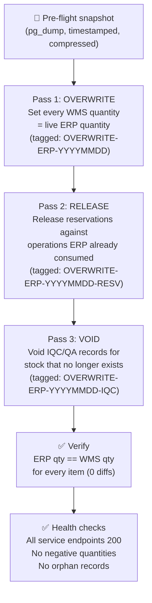

> **TL;DR** — When two inventory systems drift and you need to pick one as authoritative, a "just set WMS to match ERP" overwrite is deceptively simple. Here's the pattern for doing it safely, with a tagged audit trail, three separate passes, and a snapshot you can restore in under five minutes.

---

## When You Need an Authoritative Overwrite

Co-master architectures (two systems sharing inventory authority) accumulate drift. The drift grows from:

- Operations recorded in one system that the other never learned about (subcontractor flows, internal transfers)
- Race conditions during sync
- Bugs in the dedup logic that let the same receipt create two inventory rows

At some point, the drift reaches a level where incremental reconciliation takes longer than a clean reset. The decision to overwrite is a business decision — it means declaring one system authoritative and discarding the other's divergence.

This post covers the *execution* once that decision is made.

## The Three-Pass Pattern



Why three passes instead of one?

- **Pass 1** sets quantities. At this point, some reservations reference MO consume events that ERP already executed — the ERP "used" the stock, but WMS still holds it reserved.
- **Pass 2** releases those stale reservations. MO reservations in ERP = stock was consumed; releasing them in WMS reflects reality.
- **Pass 3** voids IQC/QA records for stock that was zeroed out. You can't have an IQC queue for 500 units if WMS now shows 0.

Each pass uses the service layer (not direct SQL) — otherwise JSON side-columns like `sub_stocks` won't stay consistent with the main quantity columns.

## Fresh ERP Data Is Non-Negotiable

Pull ERP quantities fresh immediately before the overwrite. Do not use:
- A snapshot from earlier in the day
- A cached file from a previous sync job
- Any data more than 30 minutes old

The ERP may have processed receipts or manufacturing orders while you were preparing the overwrite. Stale data means you overwrite *to an already-stale state*, and you'll drift immediately again.

If the ERP API has a connection-count limit (see [Four Gates That Became One](/posts/four-gates-that-became-one-serializing-background-jobs-that-share-a-connection-pool/)), paginate gently:

```python
def gentle_paginate(model, domain, fields, page_size=200):
    offset = 0
    total = client.execute(model, 'search_count', domain)
    while offset < total:
        batch = client.execute(model, 'search_read', domain,
                               fields, offset=offset, limit=page_size)
        if not batch:
            break
        yield from batch
        offset += len(batch)   # advance by actual returned count, not page_size
```

Advancing by `len(batch)` (not `page_size`) handles the edge case where the last page is smaller, and avoids double-counting if records are added during pagination.

## Tagging Every Adjustment

Every row written during the overwrite should carry a tag that:
1. Identifies which overwrite run created it
2. Identifies which pass within that run
3. Can be used to reverse the entire operation if needed

```python
tags = {
    "pass1": "OVERWRITE-ERP-20260612",
    "pass2": "OVERWRITE-ERP-20260612-RESV",
    "pass3": "OVERWRITE-ERP-20260612-IQC",
}
```

This means you can answer "what did the overwrite change?" with a single query filtered by tag prefix.

## Verification Criteria

The overwrite is complete when:

| Check | Threshold |
|-------|-----------|
| ERP qty == WMS qty | 100% match, 0 diffs |
| Negative quantities | 0 |
| Orphan reservations | 0 |
| Service health endpoints | All 200 OK |
| Stockcard anchor rows | ≥ 0 (no impossible negatives) |

Run these checks *before* re-enabling automated sync jobs. Re-enabling sync while a verification check is failing will mask whether any remaining discrepancy was pre-existing or introduced by the sync.

## The Escape Hatch

The snapshot taken before Pass 1 should be:
- `pg_dump` with schema + data
- gzip-compressed and timestamped
- Restored with a single command documented in the README

If the overwrite produces unexpected results after verification, restore to the snapshot and re-examine the ERP pull data before trying again. Do not attempt a second overwrite without understanding why the first one produced unexpected results.

## What Comes After

After a clean overwrite, drift will return if the underlying causes are not addressed. The overwrite buys time and a clean baseline. The permanent fix is idempotent writes — every record written to either system carries a source key, and the receiving system skips duplicates by that key regardless of which path the record arrived through.

## Related Posts
- [Is the Number Wrong, or Is the Stock Gone?](/posts/is-the-number-wrong-or-is-the-stock-gone-reconciliation-without-false-alarms/)
- [Cross-Path Idempotency](/posts/cross-path-idempotency/)
