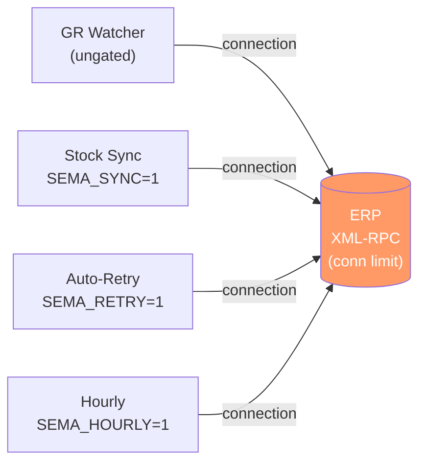
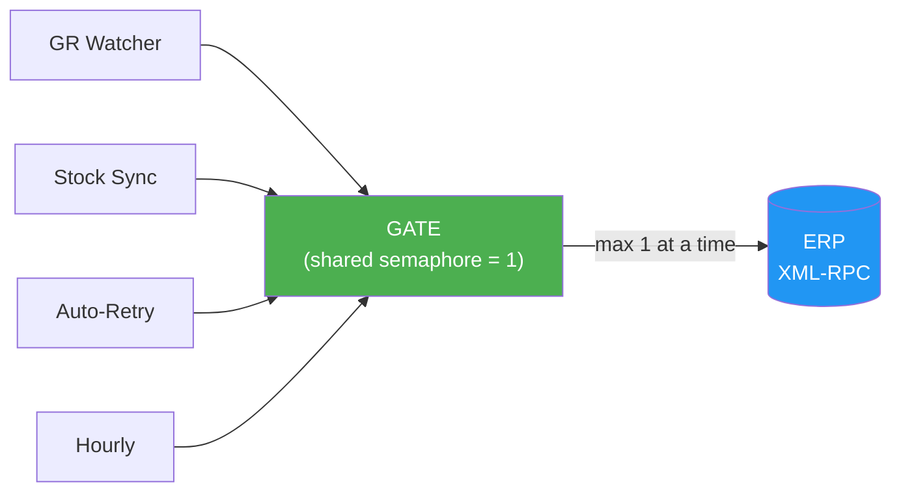

> **TL;DR** — Four asyncio semaphores that guard the same external API are not one semaphore. They're four separate locks that can all be held at once. When background jobs multiplied, the "protected" integration endpoint started refusing connections. The fix was a single shared gate.

---


_&#8220;Each job has a gate&#8221; isn&#8217;t &#8220;at most one ERP call at a time&#8221; &#8212; carry the shared gate explicitly when you split a scheduler into modules._

## The Setup

A WMS runs several background schedulers that call an external ERP via XML-RPC:

| Job | Frequency | Purpose |
|-----|-----------|---------|
| GR watcher | every 2 min | pull new receipts |
| Stock sync | every 15 min | sync quantities |
| Auto-retry | on demand | retry blocked sync jobs |
| Hourly reconcile | every 60 min | compare counts |

Each job had its own semaphore — created when the scheduler was split into separate modules. Each lock prevents a job from overlapping *itself*. That's useful. But it does nothing to prevent four jobs running at the same time.

## The Problem



Peak concurrency = 4–5 simultaneous ERP connections. The ERP endpoint runs on a cloud droplet with a limited connection pool. Under normal timing, collisions were rare. After adding the high-frequency GR watcher, `Connection refused` started appearing on bulk reads.

Diagnosis: light reads (1–5 calls) worked. Bulk reads (50–200 sequential calls) failed. TCP port was open. The problem was **burst connection count**, not ERP availability.

## The Fix

One module-level semaphore, shared across all jobs:

```python
# scheduler_gate.py
import asyncio
GATE = asyncio.Semaphore(1)   # one ERP call stream at a time

# Re-export old names so callers don't need to change
GATE_MASTER = GATE
GATE_HOT    = GATE
GATE_SYNC   = GATE
```

Python module imports are singletons — all callers reference the same object:



Additional changes: gated the previously ungated watcher, reduced its poll interval (2 min → 5 min), added `run_count` metric to confirm at most 1 concurrent ERP call.

## Checklist Before Splitting Background Jobs

When refactoring a monolithic scheduler into modules, carry the shared gate explicitly:

- [ ] List **every caller** of the external API — not just the ones you're refactoring
- [ ] Count **max concurrent holders** — `n_modules` semaphores = `n_modules` possible concurrent calls
- [ ] Check **ungated callers** — watchers, ad-hoc triggers, and webhooks often skip the gate
- [ ] Verify **gate identity** — `id(GATE_A) == id(GATE_B)` must be `True` for a shared lock

"Each job has a gate" ≠ "at most one ERP call at a time."

## Related Posts
- [It Said "Connection Refused." The Server Was Fine.](/posts/it-said-connection-refused/)
