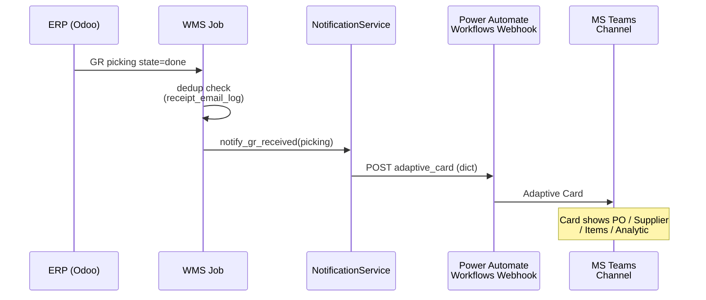
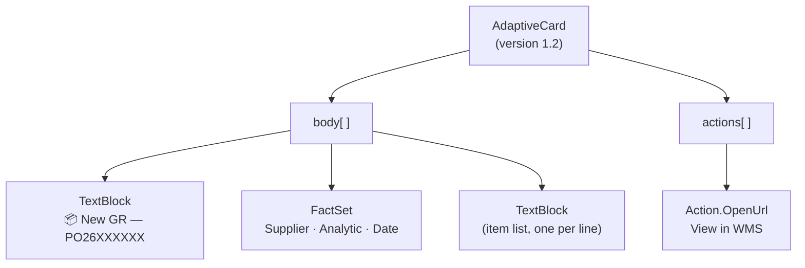

> **TL;DR** — When a goods receipt arrives, the warehouse team needs to know immediately — not after they check the system. Here's the architecture for wiring WMS events to Microsoft Teams using Adaptive Cards, plus the one-line bug that silently broke it for hours.

---

## The Flow



Key design choices:
- **30-minute poll** (not webhook from ERP): ERP-side webhooks are fragile; polling is self-healing
- **Dedup table** with a watermark — prevents re-sending on restart, and blocks historical blast
- **Cutoff watermark** set on first run — if the job has never run, it picks up from "now", not from day one

## The Bug

The Teams notification failed silently for 4 hours. All Power Automate runs showed `Failed`. The error: `InvalidBotRequestMessageBody`.

Root cause:

```python
# BROKEN — sends a JSON string, not a JSON object
payload = {
    "type": "message",
    "attachments": [{
        "contentType": "application/vnd.microsoft.card.adaptive",
        "content": json.dumps(card)   # ← string, not dict
    }]
}

# CORRECT — content must be the dict itself
payload = {
    "type": "message",
    "attachments": [{
        "contentType": "application/vnd.microsoft.card.adaptive",
        "content": card               # ← dict
    }]
}
```

The `content` field of a Teams Adaptive Card attachment must be a **JSON object**, not a **JSON string**. Python's `requests` library serializes the outer dict with `json=payload`, so the card gets double-serialized if you call `json.dumps()` on the inner content.

The fix is one character: remove the `json.dumps()` call.

## Adaptive Card Structure



Minimal working structure:

```python
card = {
    "type": "AdaptiveCard",
    "$schema": "http://adaptivecards.io/schemas/adaptive-card.json",
    "version": "1.2",
    "body": [
        {
            "type": "TextBlock",
            "text": f"📦 New GR — {po_number}",
            "weight": "Bolder",
            "size": "Medium"
        },
        {
            "type": "FactSet",
            "facts": [
                {"title": "Supplier", "value": supplier_name},
                {"title": "Project",  "value": analytic_label},
                {"title": "Received", "value": received_at_local},
            ]
        },
        {
            "type": "TextBlock",
            "text": items_text,   # newline-separated, use \n\n not \r
            "wrap": True
        }
    ]
}
```

Watch out: `\r\n` line endings in item text render as literal `\r` in some Teams clients. Use `\n\n` (double newline) for line breaks inside a TextBlock.

## Power Automate vs Direct Webhook

Two approaches exist:

| | Power Automate Workflow | Incoming Webhook (legacy) |
|--|------------------------|--------------------------|
| Auth | Webhook URL only | Webhook URL only |
| Card version | Adaptive Card 1.x | Adaptive Card 1.x |
| Setup | Teams → Workflows app | Teams → Connectors (deprecated 2024) |
| Reliability | Managed by Microsoft | Self-managed |

Use **Teams Workflows** (not the old Incoming Webhook connector — Microsoft deprecated it in 2024). The Workflows webhook accepts the same payload shape.

## Alerting on ERP Unreachability

The GR watcher polls the ERP. If the ERP is down, the original code returned silently (shape identical to "0 new receipts"). Add an explicit signal:

```python
try:
    receipts = erp_client.search_read(...)
except ConnectionRefusedError:
    metrics["odoo_unreachable"] += 1
    maybe_alert_outage()   # throttled: max 1 alert per 30 min
    return
```

Throttle the outage alert — the watcher runs every few minutes, so an unthrottled alert would spam the channel every tick during an outage.

## Related Posts
- [It Said "Connection Refused." The Server Was Fine.](/posts/it-said-connection-refused/)
- [Four Gates That Became One](/posts/four-gates-that-became-one-serializing-background-jobs-that-share-a-connection-pool/)
