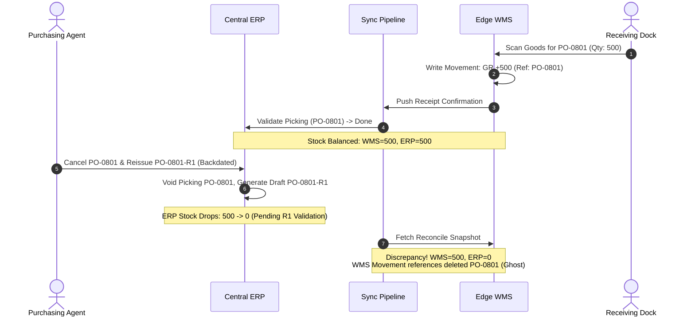
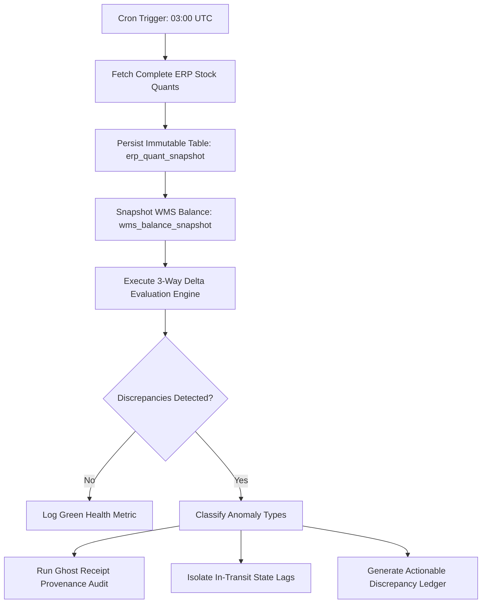

> **TL;DR** — In a co-master architecture where WMS owns physical movement and ERP owns financial valuation, inventory drift is not a matter of "if" but "when". Silent drift is driven by three systemic traps: picking state lag, cancel-and-backdate reissue cycles (ghost receipts), and unledgered balance writes. Eliminating drift requires moving away from continuous delta pushes toward immutable daily quant snapshots paired with 3-way delta tracking and SAVEPOINT-isolated reconciliation jobs.

---


_Two ledgers, one truth: snapshot-driven reconciliation detects state lag, unledgered writes, and backdated reissue anomalies before they become audit blockers._

## The Inevitable Divergence of Two Ledgers

When separating operational warehouse management (WMS) from enterprise resource planning (ERP), the division of responsibilities seems clear on paper:

- **Operational Ledger (WMS):** Tracks barcodes, bins, pallet moves, IQC inspection states, and physical dock receiving in real time.
- **Financial Ledger (ERP):** Tracks purchase orders, vendor invoices, landed costs, and moving average inventory valuations.

In practice, both systems must maintain a number representing **on-hand stock** for every SKU at every warehouse location. The operational team needs it to dispatch picking lists without sending pickers to empty bins; the accounting team needs it to close monthly balance sheets and calculate Cost of Goods Sold (COGS).

Despite strict API syncs and message queues, these two numbers will inevitably drift apart. A system reporting zero drift over six months is almost certainly not measuring drift correctly &#8212; it is merely failing to look at the gap between operational reality and financial accounting.

```
+-----------------------------------------------------------------------------+
|                               THE DRIFT GAP                                 |
|                                                                             |
|   Physical Warehouse Floor:  [ 1,000 pcs in Bin A-04 ]                      |
|                                                                             |
|   Operational Ledger (WMS):  [ 1,000 pcs on-hand ]                          |
|                              - IQC Passed: 800 pcs                          |
|                              - IQC Pending: 200 pcs                         |
|                                                                             |
|   Financial Ledger (ERP):    [   800 pcs in Stock ]                         |
|                              - 200 pcs stuck in 'assigned' picking state    |
|                                                                             |
|   Unadjusted Delta:          [ +200 pcs Operational Drift ]                 |
+-----------------------------------------------------------------------------+
```

When an audit occurs, a raw comparison between `wms_inventory` and `erp_stock_quant` will flag a massive discrepancy. But is it real shrinkage, or an architectural artifact?

---

## Anatomy of Drift: The Three Systemic Traps

Through systematic post-incident reviews across high-volume electronics manufacturing operations, we identified three distinct mechanisms responsible for over 95% of chronic stock discrepancies.

```
                      +----------------------------------+
                      |   CHRONIC DATA DRIFT CAUSES      |
                      +-----------------+----------------+
                                        |
         +------------------------------+-----------------------------+
         |                              |                             |
         v                              v                             v
+------------------+          +-------------------+         +-------------------+
|  1. STATE LAG    |          | 2. GHOST RECEIPTS |         | 3. UNLEDGERED     |
|                  |          |                   |         |    DIRECT WRITES  |
| Receiving done   |          | PO cancelled &    |          | Balance table     |
| in WMS, but ERP  |          | reissued back-    |          | updated directly  |
| picking remains  |          | dated; leaves     |          | bypassing the     |
| in 'assigned'.   |          | orphaned movement.|          | movement history. |
+------------------+          +-------------------+         +-------------------+
```

### 1. The Picking State Lag (False Drift)

When goods arrive at the dock, warehouse operators scan vendor barcodes, perform lot sampling at Incoming Quality Control (IQC), and put items away. 

In the WMS, this creates an immediate positive balance in the item ledger. However, the corresponding ERP receipt picking document often transitions through intermediate states (`draft` &rarr; `waiting` &rarr; `assigned` &rarr; `done`).

If the ERP background worker fails to transition the picking to `done` &#8212; due to validation locks, concurrent write conflicts, or user authorization delays &#8212; the physical stock exists in the warehouse, but the ERP valuation ledger has not recognized it yet.

{: .prompt-warning }
> **The Trap:** Naive reconciliation scripts that filter only by product SKU and total quantity will flag this as an "Unexplained Surplus" in WMS. If an automated script attempts to "correct" this by writing a negative adjustment to WMS, it destroys the physical ledger. When the ERP picking finally completes hours later, the warehouse becomes short by that exact quantity.

### 2. The Cancel & Backdated Reissue Cycle (Ghost Receipts)

Purchasing teams frequently renegotiate vendor terms, split line items, or adjust unit prices after physical delivery has begun. The standard ERP workflow is:

1. Cancel existing Purchase Order (`PO-2026-0801`).
2. Void associated ERP incoming shipments.
3. Reissue a revised Purchase Order (`PO-2026-0801-R1`) with an effective backdate.



The original WMS movement record remains permanently tied to the cancelled PO number. When the new PO is confirmed, the sync engine may attempt to ingest the new receipt, resulting in a **duplicate receipt count** (counting both the original physical receipt and the reissued document).

### 3. The Unledgered Write Gap

In legacy systems, balance tables (`stock_balance` or `item_context`) are often treated as mutable key-value stores. Developers add features such as "Quick Bin Transfer" or "Scrap Adjustment" with direct SQL updates:

```sql
-- DANGEROUS: Unledgered direct balance mutation
UPDATE item_context 
SET on_hand_qty = on_hand_qty - 50 
WHERE item_code = 'RES-0402-10K' AND location_code = 'LOC-SMT-01';
```

If this update is executed without an accompanying row inserted into the immutable `item_movements` table, the on-hand quantity no longer equals the sum of historical movements:

$$\text{Current On-Hand} \neq \sum \text{Historical Movements}$$

When the reconciliation engine audits the ledger by summing transaction history, the ledger fails self-consistency verification before it even compares against the ERP.

---

## The 3-Way Reconcile Algorithm

To eliminate false alarms and pinpoint real discrepancies, reconciliation must evaluate three distinct data streams simultaneously:

1. **$Q_{\text{phys}}$ (Physical WMS Balance):** Live on-hand quantity in the operational database.
2. **$Q_{\text{ledger}}$ (WMS Cumulative Ledger):** Mathematical sum of all immutable movement rows ($\sum \text{GR} - \sum \text{GI} \pm \sum \text{TRN} \pm \sum \text{ADJ}$).
3. **$Q_{\text{quant}}$ (ERP Financial Snapshot):** Immutable snapshot of ERP valuation quants captured at a frozen point in time.

```
                +------------------------------------+
                |       3-WAY RECONCILIATION         |
                +-----------------+------------------+
                                  |
            +---------------------+--------------------+
            |                                          |
            v                                          v
+------------------------+                 +------------------------+
| INTERNAL INTEGRITY     |                 | EXTERNAL RECONCILE     |
|                        |                 |                        |
| Delta_int =            |                 | Delta_ext =            |
|   Q_phys - Q_ledger    |                 |   Q_phys - Q_quant     |
|                        |                 |                        |
| Target: EXACTLY 0      |                 | Target: 0 (after state |
| If != 0 -> Unledgered  |                 |            lag filter) |
|            write bug!  |                 |                        |
+------------------------+                 +------------------------+
```

### Mathematical Delta Classification

Every item evaluated during reconciliation is categorized into one of five deterministic states:

$$\Delta_{\text{ext}} = Q_{\text{phys}} - Q_{\text{quant}}$$

| Condition | Classification | Root Cause | System Action |
|:---|:---|:---|:---|
| $\Delta_{\text{ext}} = 0 \land \Delta_{\text{int}} = 0$ | **MATCH (Green)** | Systems fully synchronized | No action required. |
| $\Delta_{\text{int}} \neq 0$ | **INTERNAL_CORRUPTION (Red)** | Direct DB write without movement row | Lock item; require ledger repair. |
| $\Delta_{\text{ext}} > 0 \land \text{PickingState} = \text{'assigned'}$ | **IN_TRANSIT_LAG (Yellow)** | Dock receiving done, ERP pending validation | Suppress alert; re-evaluate next cycle. |
| $\Delta_{\text{ext}} \neq 0 \land \text{DocState} = \text{'cancelled'}$ | **GHOST_RECEIPT (Red)** | PO cancelled/reissued after physical receipt | Trigger Document Provenance Re-link. |
| $\Delta_{\text{ext}} \neq 0 \land \text{Unexplained}$ | **TRUE_DISCREPANCY (Red)** | Physical shrinkage or unrecorded scrap | Generate physical count work order. |

---

## Architectural Implementation: The Scheduled Quant Snapshot

Reconciling against a live ERP database via synchronous RPC during operating hours is flawed. As warehouse pickers confirm pick waves and trucks unload at the dock, inventory moves constantly. A comparison made at 14:00 will show false discrepancies simply because Table A was read at 14:00:01 and Table B was read at 14:00:04.

The solution is an **As-Of Snapshot Pipeline** executed during the quietest warehouse window (e.g., 03:00 UTC).



### 1. Capturing the Immutable Snapshot

The reconciler extracts all non-zero inventory quants directly from the ERP core and writes them to a dedicated table:

```sql
CREATE TABLE erp_quant_snapshot (
    snapshot_id VARCHAR(64) NOT NULL,
    snapshot_date DATE NOT NULL,
    product_sku VARCHAR(64) NOT NULL,
    location_code VARCHAR(64) NOT NULL,
    lot_number VARCHAR(64),
    quantity NUMERIC(15, 4) NOT NULL,
    unit_cost NUMERIC(15, 4),
    captured_at TIMESTAMP WITH TIME ZONE DEFAULT CURRENT_TIMESTAMP,
    CONSTRAINT pk_erp_quant_snapshot PRIMARY KEY (snapshot_id, product_sku, location_code, lot_number)
);

CREATE INDEX idx_snapshot_lookup ON erp_quant_snapshot(snapshot_date, product_sku);
```

### 2. The Reconciler Core with SAVEPOINT Isolation

When processing reconciliation runs across tens of thousands of SKUs, a single malformed SKU string or null-byte payload must not abort the entire multi-thousand-item audit run. 

The reconciliation engine uses `SAVEPOINT` transaction isolation for each evaluated partition:

```python
def reconcile_inventory_partition(db_session, snapshot_date: date, sku_batch: list[str]):
    """
    Evaluates inventory parity for a partition of SKUs using SAVEPOINT isolation.
    Ensures single-item failures do not invalidate the entire reconciliation run.
    """
    results = []
    
    for sku in sku_batch:
        # Create an isolated transaction savepoint
        savepoint = db_session.begin_nested()
        try:
            wms_on_hand = get_wms_physical_stock(db_session, sku)
            wms_ledger_sum = get_wms_ledger_sum(db_session, sku)
            erp_snapshot_qty = get_erp_snapshot_stock(db_session, snapshot_date, sku)
            
            # Step 1: Verify Internal Ledger Integrity
            delta_int = wms_on_hand - wms_ledger_sum
            if delta_int != Decimal("0.0"):
                record_internal_corruption(db_session, sku, delta_int)
                savepoint.commit()
                continue
                
            # Step 2: Evaluate External Drift
            delta_ext = wms_on_hand - erp_snapshot_qty
            if delta_ext != Decimal("0.0"):
                # Check for active picking state lag
                pending_lag_qty = get_pending_picking_lag(db_session, sku)
                true_drift = delta_ext - pending_lag_qty
                
                record_discrepancy(
                    db_session,
                    sku=sku,
                    wms_qty=wms_on_hand,
                    erp_qty=erp_snapshot_qty,
                    lag_qty=pending_lag_qty,
                    true_drift=true_drift
                )
            
            savepoint.commit()
        except Exception as err:
            savepoint.rollback()
            logger.error("Failed reconciling SKU %s: %s", sku, str(err))
            record_reconcile_error(db_session, sku, str(err))
            
    db_session.commit()
```

---

## The Provenance Map: Resolving Ghost Receipts

When a purchase order is cancelled and reissued, the physical inventory already sitting on warehouse shelves must be re-attributed to the new financial document without generating duplicate stock entries.

We implement a **Document Provenance Map**:

```sql
CREATE TABLE doc_provenance_map (
    map_id UUID PRIMARY KEY DEFAULT gen_random_uuid(),
    original_doc_type VARCHAR(32) NOT NULL, -- e.g., 'PO_RECEIPT'
    original_doc_ref VARCHAR(64) NOT NULL,  -- e.g., 'PO-2026-0801'
    superseded_by_ref VARCHAR(64) NOT NULL, -- e.g., 'PO-2026-0801-R1'
    item_code VARCHAR(64) NOT NULL,
    remapped_quantity NUMERIC(15, 4) NOT NULL,
    relink_status VARCHAR(32) NOT NULL,     -- 'MAPPED', 'APPLIED', 'REJECTED'
    created_at TIMESTAMP WITH TIME ZONE DEFAULT CURRENT_TIMESTAMP
);
```

When the reconciler identifies an orphaned movement linked to a voided ERP document:

1. It searches ERP audit logs for the newly issued replacement PO containing matching item codes and quantities.
2. It inserts a re-attribution link into `doc_provenance_map`.
3. The sync engine recognizes the mapping and **updates the reference pointer** on the existing WMS movement rather than attempting to ingest the new PO receipt as fresh physical stock.

```
[ WMS Movement #44021 ] ---> Points to: [ PO-2026-0801 (CANCELLED) ]
                                            |
                                            | (Provenance Remapping)
                                            v
[ WMS Movement #44021 ] ---> Points to: [ PO-2026-0801-R1 (VALID) ]

Result: Physical stock remains 500 pcs. No duplicate receipt generated.
```

---

## Production Hardening Checklist

Before deploying a dual-ledger reconciliation pipeline into production, verify these non-negotiable operational invariants:

```
[ ] 1. NEVER AUTO-ADJUST STOCK BASED ON LIVE RPC
       Only evaluate reconciliation against scheduled, immutable snapshots
       captured during zero-activity or low-activity windows.

[ ] 2. DATABASE TRIGGERS FOR BALANCES
       Install database-level constraints or triggers ensuring no row in
       the balance table can be updated without an accompanying ledger row.

[ ] 3. STATUS-AWARE DRIFT FILTERS
       Always subtract pending/in-transit ERP document lines before flagging
       an item as a true discrepancy.

[ ] 4. SAVEPOINT BATCHING
       Wrap reconciliation evaluations in nested savepoints so that one corrupt
       part number cannot fail a 50,000-item reconciliation run.

[ ] 5. PROVENANCE RE-LINKING OVER DELETION
       Never delete or void historical WMS movement rows when ERP POs are
       cancelled. Use provenance mapping to re-link operational history to
       new financial records.
```

---

## Related Posts

-  &#8212; Splitting operational movements from financial valuation in co-master setups.
-  &#8212; Eliminating transient timing false alarms in multi-system pipelines.
-  &#8212; Safety protocol for database mutations and stock corrections.
-  &#8212; Guarding against payload dropouts and destructive sync operations.
