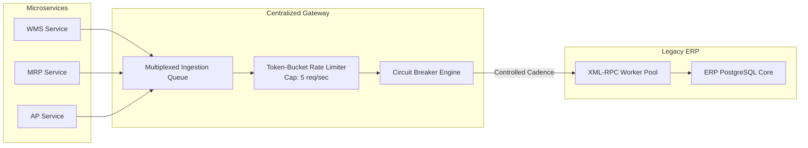

> **TL;DR** — Integrating modern microservices (WMS, MRP, MES, RFQ) with a legacy ERP backend frequently triggers chronic connection refusals and worker starvation. The root cause is almost never ERP database performance, but the synchronous burst pattern of uncoordinated cron jobs. Resilient integration requires a centralized ERP Gateway featuring token-bucket rate limiting, jittered exponential backoff, circuit-breaker fallbacks, and multi-schema PostgreSQL isolation that prevents cross-service database locks.

---


_Surviving the ERP bottleneck: replacing aggressive burst polling with centralized rate limiting and multi-schema database isolation._

## The Legacy ERP Bottleneck

Modern web architectures favor decomposing business functions into focused, independent services: a WMS for barcode scanning, an MRP engine for material scheduling, a CRM for opportunity tracking, and an AP Tracker for three-way invoice matching.

However, all of these services must ultimately exchange data with a central monolithic ERP (such as Odoo 12, SAP R/3, or legacy AS400 systems). These monolithic ERPs typically expose synchronous RPC endpoints (XML-RPC, JSON-RPC, or SOAP) designed in an era when user workstations submitted transactions one form at a time.

When four microservices each run scheduled synchronization jobs, they subject the legacy ERP to a traffic pattern it was never designed to handle:

```
[ WMS Sync Cron ] --- (50 concurrent RPCs at 00:00) ---> +-----------------------+
[ MRP Plan Cron ] --- (40 concurrent RPCs at 00:00) ---> |   LEGACY ERP ENGINE   |
[ AP Match Cron ] --- (20 concurrent RPCs at 00:00) ---> | (4 XML-RPC Workers)   |
[ MES Hook Sync ] --- (15 concurrent RPCs at 00:00) ---> +-----------+-----------+
                                                                     |
                                                           [ WORKER STARVATION ]
                                                           [ HTTP 502 / REFUSE ]
```

The symptom reported by developers is invariably: *"The ERP server crashed or refused connection randomly."*

In reality, the ERP server did not crash. Its small pool of single-threaded worker processes was completely exhausted within 200 milliseconds, causing incoming TCP connections to queue up and exceed the operating system's `backlog` limit, triggering immediate `ECONNREFUSED` failures.

---

## The Burst Refusal Phenomenon

To understand why simple retry loops make this problem worse, examine the timeline of a typical burst refusal:

```
Time (ms)  Event
-------------------------------------------------------------------------------
T + 000    Cron fires at the top of the hour across 4 containers simultaneously.
T + 050    120 XML-RPC requests hit the ERP reverse proxy within 50ms.
T + 100    All 4 ERP worker threads become occupied executing heavy SQL queries.
T + 150    Proxy request queue fills up. New incoming connections are refused.
T + 200    WMS and MRP catch ECONNREFUSED and immediately fire naive retry loops.
T + 250    Retry wave hits while workers are still 80% through original queries.
T + 500    Total cascading failure: 100% of sync jobs fail with timeout errors.
```

Adding naive `try/except: retry()` blocks creates a self-inflicted Distributed Denial of Service (DDoS) attack against your own ERP core.

---

## The Gentle Polling Architecture

The solution is to decouple microservices from direct ERP communication using a **Centralized Gateway Daemon** equipped with three resilience mechanisms:



### 1. Token-Bucket Rate Limiter

Regardless of how many microservices request ERP data simultaneously, outbound calls to the legacy XML-RPC endpoint are strictly rate-limited through a token bucket capped at safe operational concurrency (e.g., 5 requests per second):

```python
import time
import threading
from typing import Callable, Any

class TokenBucketRateLimiter:
    def __init__(self, rate_per_second: float = 5.0, capacity: float = 10.0):
        self.rate = rate_per_second
        self.capacity = capacity
        self.tokens = capacity
        self.last_update = time.monotonic()
        self.lock = threading.Lock()

    def acquire(self, tokens_needed: float = 1.0) -> None:
        while True:
            with self.lock:
                now = time.monotonic()
                elapsed = now - self.last_update
                self.last_update = now
                
                # Replenish tokens based on elapsed time
                self.tokens = min(self.capacity, self.tokens + elapsed * self.rate)
                
                if self.tokens >= tokens_needed:
                    self.tokens -= tokens_needed
                    return
                
                # Calculate sleep duration until next token is available
                wait_time = (tokens_needed - self.tokens) / self.rate
                
            time.sleep(wait_time)
```

### 2. Jittered Exponential Backoff

When transient network hiccups or ERP database locks occur, retries must incorporate full random jitter to prevent synchronous harmonic waves:

$$T_{\text{wait}} = \min\left(T_{\max}, \; T_{\text{base}} \times 2^{\text{retry}}\right) \times \left(0.5 + \text{random}(0.0, 0.5)\right)$$

```python
import random

def execute_with_jittered_backoff(
    rpc_func: Callable[[], Any],
    max_retries: int = 5,
    base_delay: float = 1.0,
    max_delay: float = 30.0
) -> Any:
    for attempt in range(max_retries):
        try:
            return rpc_func()
        except (ConnectionRefusedError, TimeoutError) as err:
            if attempt == max_retries - 1:
                raise err
            
            # Calculate exponential delay with randomized jitter
            backoff = min(max_delay, base_delay * (2 ** attempt))
            jittered_sleep = backoff * random.uniform(0.5, 1.5)
            time.sleep(jittered_sleep)
```

### 3. Fast-Fail Circuit Breakers

If the ERP server is genuinely undergoing maintenance or offline backup, downstream microservices should not hang indefinitely. The Circuit Breaker transitions between three states:

- **CLOSED (Normal):** Requests pass through to ERP.
- **OPEN (Tripped):** After 3 consecutive timeouts, immediately fail fast without sending requests to ERP. Serve cached or read-only replica data.
- **HALF-OPEN (Probe):** After a 60-second cooldown, allow a single probe request. If successful, reset to CLOSED; if failed, remain OPEN.

---

## Safe Read/Write Segregation (Direct SQL vs. XML-RPC)

A fundamental architectural rule when integrating with legacy ERPs is **Segregation of Access Methods**:

```
+-----------------------------------------------------------------------------+
|                     ACCESS METHOD SEGREGATION RULE                          |
|                                                                             |
|   1. READ-ONLY DATA (Heavy Analytics, Stock Snapshots, Reports):            |
|      --> DIRECT SQL (Read Replica)                                          |
|      Bypasses slow XML-RPC serialization; executes in 5ms instead of 4000ms.  |
|                                                                             |
|   2. WRITE / MUTATION DATA (Confirming Pickings, Posting Invoices, MOs):    |
|      --> OFFICIAL XML-RPC API                                               |
|      Ensures ERP ORM triggers, fiscal validations, and journal entries run.  |
+-----------------------------------------------------------------------------+
```

{: .prompt-danger }
> **The Anti-Pattern:** Never write directly to the ERP database with SQL `INSERT` or `UPDATE` statements to bypass slow RPC endpoints. Doing so bypasses accounting ledgers, sequences, and computed fields, permanently corrupting the corporate financial audit trail.

---

## PostgreSQL Multi-Schema Isolation Architecture

When running multiple microservices on a shared PostgreSQL server, placing all tables into the default `public` schema creates high organizational coupling and dangerous migration locks.

We implement a **Multi-Schema Segregation Pattern**:

```
                           +-------------------------------------+
                           |      PRODUCTION POSTGRESQL DB       |
                           +------------------+------------------+
                                              |
            +---------------+-----------------+---------------+---------------+
            |               |                 |               |               |
            v               v                 v               v               v
     +------------+  +------------+    +------------+  +------------+  +------------+
     | Schema:    |  | Schema:    |    | Schema:    |  | Schema:    |  | Schema:    |
     | [ wms ]    |  | [ mrp ]    |    | [ rfq ]    |  | [ crm ]    |  | [ sync ]   |
     |            |  |            |    |            |  |            |  |            |
     | owns:      |  | owns:      |    | owns:      |  | owns:      |  | owns:      |
     | movements, |  | planning,  |    | costing,   |  | pipelines, |  | snapshots, |
     | bins, iqc  |  | bom_tree   |    | geometry   |  | leads      |  | provenance |
     +------------+  +------------+    +------------+  +------------+  +------------+
```

### Decoupling Schema Migrations (Alembic)

By assigning each service its own PostgreSQL schema and separate `alembic_version` table:

1. **Independent Deployments:** The WMS team can deploy migration `014` without locking tables used by MRP.
2. **Zero Cross-Schema Foreign Keys:** Services reference each other via logical IDs (e.g., `product_sku VARCHAR(64)`), preventing `ALTER TABLE` locks from cascading across services.
3. **Isolated User Permissions:** Service credentials are restricted via `GRANT USAGE ON SCHEMA` and `REVOKE ALL ON ALL TABLES IN SCHEMA public`, preventing accidental cross-database writes.

```sql
-- PostgreSQL Multi-Schema Role Hardening
CREATE SCHEMA wms;
CREATE SCHEMA mrp;
CREATE SCHEMA sync;

CREATE USER wms_service_user WITH PASSWORD 'redacted_vault_secret';
GRANT USAGE ON SCHEMA wms TO wms_service_user;
GRANT ALL PRIVILEGES ON ALL TABLES IN SCHEMA wms TO wms_service_user;
REVOKE ALL PRIVILEGES ON SCHEMA public FROM wms_service_user;
```

---

## Production Hardening Checklist

```
[ ] 1. NEVER ALLOW UNLIMITED CONCURRENT RPC POLLING
       Funnel all ERP requests through a centralized rate-limiting gateway
       capped at maximum safe worker concurrency (3–5 req/sec).

[ ] 2. JITTER EVERY CRON AND RETRY SCHEDULE
       Add random offset (+/- 30 seconds) to hourly synchronization crons
       to prevent simultaneous harmonic request bursts.

[ ] 3. STRICT READ/WRITE METHOD SEPARATION
       Read heavy analytics via SQL Read Replica; execute mutations strictly
       through official ERP XML-RPC endpoints.

[ ] 4. FAST-FAIL CIRCUIT BREAKERS
       Prevent cascading microservice timeouts by failing fast when the ERP
       fails three consecutive health probes.

[ ] 5. ISOLATE MICROSERVICE DATABASE SCHEMAS
       Use distinct PostgreSQL schemas with independent migration tables
       to eliminate DDL locking cascades across service boundaries.
```

---

## Related Posts

-  &#8212; Diagnosing socket backlog saturation and ECONNREFUSED on edge services.
-  &#8212; Schema-based isolation patterns for multi-tenant microservices.
-  &#8212; Consolidating distributed cron tasks into unified pipeline gates.
-  &#8212; Snapshot-driven reconciliation between operational WMS and ERP.
