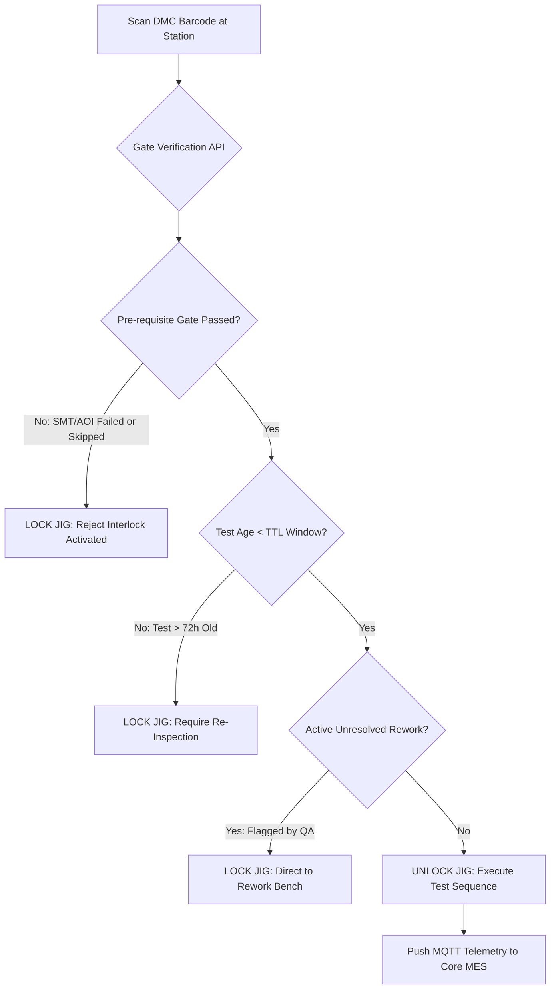

> **TL;DR** — In high-mix electronics manufacturing, flat serial tracking fails the moment a product contains multiple circuit boards, sub-assemblies, or modular sensors. Implementing true zero-trust shop floor traceability requires hierarchical parent-child 2D Data Matrix Code (DMC) binding, state-enforced station gates (rejecting test execution if prerequisite stages are missing or stale), and resilient MQTT edge ingestion that handles data coercion and offline buffer fail-safes.

---


_Hierarchical genealogy: binding PCBA child barcodes to enclosure parent serials ensures instant root-cause analysis down to component reel lot numbers._

## Why Flat Serial Numbers Fail in Modern Electronics

In simple assembly lines, a single serial number sticker placed on an outer casing might suffice. However, in modern electronics (such as IoT gateways, automotive controllers, and industrial smart meters), a finished unit consists of:

1. **Main Processing Board (PCBA 1):** MCU, Flash, Power Management, Laser-etched DMC.
2. **RF / Communications Daughterboard (PCBA 2):** Cellular/LoRa module, etched DMC.
3. **Power & Sensor Interface Board (PCBA 3):** Relays, connectors, etched DMC.
4. **Mechanical Enclosure:** Laser-marked or printed housing serial.

```
                           +-------------------------------------+
                           |    PARENT: Finished Box Build Serial |
                           |       [ SN-2026-BX-098842 ]         |
                           +------------------+------------------+
                                              |
                     +------------------------+------------------------+
                     |                        |                        |
                     v                        v                        v
          +--------------------+   +--------------------+   +--------------------+
          | CHILD: Main Board  |   | CHILD: RF Board    |   | CHILD: Power Board |
          | [ DMC-MB-881204 ]  |   | [ DMC-RF-441920 ]  |   | [ DMC-PWR-110293 ] |
          +----------+---------+   +----------+---------+   +----------+---------+
                     |                        |                        |
           +---------+---------+              v                        v
           |                   |         Reel Lots:               Reel Lots:
           v                   v         [ R-LORA-90 ]            [ R-RELAY-12 ]
      Reel Lots:          Reel Lots:
      [ R-MCU-2026 ]      [ R-PMIC-04 ]
```

If a defect is discovered in a batch of microcontrollers three months after shipment, a flat-serial database cannot answer the critical recall question: **Which exact finished units contain the affected PCBA?**

Without hierarchical **Parent-Child DMC Binding**, the manufacturer is forced to recall entire date ranges rather than isolating the exact 340 affected serials.

---

## The Hierarchical Traceability Data Model

The core database design must support 1:N recursive parent-child associations, full event histories, and unbinding audit trails during rework.

```sql
-- 1. Immutable DMC Master Entity
CREATE TABLE mes_unit (
    unit_id UUID PRIMARY KEY DEFAULT gen_random_uuid(),
    barcode VARCHAR(128) NOT NULL UNIQUE,
    unit_type VARCHAR(32) NOT NULL, -- 'PCBA_CHILD', 'BOX_PARENT', 'CARTON_MASTER'
    product_sku VARCHAR(64) NOT NULL,
    work_order_id VARCHAR(64) NOT NULL,
    current_status VARCHAR(32) NOT NULL DEFAULT 'CREATED', -- 'PASS', 'FAIL', 'SCRAP', 'REWORK'
    created_at TIMESTAMP WITH TIME ZONE DEFAULT CURRENT_TIMESTAMP
);

-- 2. Hierarchical Association Tree (Binding Ledger)
CREATE TABLE mes_unit_binding (
    binding_id UUID PRIMARY KEY DEFAULT gen_random_uuid(),
    parent_unit_id UUID NOT NULL REFERENCES mes_unit(unit_id),
    child_unit_id UUID NOT NULL REFERENCES mes_unit(unit_id),
    binding_station_id VARCHAR(64) NOT NULL,
    operator_badge_id VARCHAR(64) NOT NULL,
    bound_at TIMESTAMP WITH TIME ZONE DEFAULT CURRENT_TIMESTAMP,
    unbound_at TIMESTAMP WITH TIME ZONE, -- NULL if actively bound
    unbind_reason VARCHAR(255),
    CONSTRAINT uq_active_child_binding UNIQUE (child_unit_id, unbound_at)
);

CREATE INDEX idx_binding_parent ON mes_unit_binding(parent_unit_id) WHERE unbound_at IS NULL;
CREATE INDEX idx_binding_child ON mes_unit_binding(child_unit_id) WHERE unbound_at IS NULL;
```

### Querying Complete Unit Genealogy in a Single Recursive CTE

When an engineer inspects a returned finished box build, a single SQL query recursively walks down the entire component tree to return every sub-assembly, test result, and component reel lot:

```sql
WITH RECURSIVE UnitGenealogy AS (
    -- Anchor member: The Parent Box Build
    SELECT 
        u.unit_id,
        u.barcode,
        u.unit_type,
        u.product_sku,
        1 AS tree_depth
    FROM mes_unit u
    WHERE u.barcode = 'SN-2026-BX-098842'
    
    UNION ALL
    
    -- Recursive member: Find all active children
    SELECT 
        child.unit_id,
        child.barcode,
        child.unit_type,
        child.product_sku,
        ug.tree_depth + 1
    FROM mes_unit_binding b
    JOIN mes_unit child ON b.child_unit_id = child.unit_id
    JOIN UnitGenealogy ug ON b.parent_unit_id = ug.unit_id
    WHERE b.unbound_at IS NULL
)
SELECT 
    ug.tree_depth,
    ug.unit_type,
    ug.barcode,
    ug.product_sku,
    t.station_id,
    t.test_result,
    t.tested_at
FROM UnitGenealogy ug
LEFT JOIN mes_test_log t ON ug.unit_id = t.unit_id
ORDER BY ug.tree_depth, ug.barcode;
```

---

## Zero-Trust Station Gates

A major source of manufacturing scrap is **out-of-sequence production** &#8212; for example, an operator placing an untested PCBA into final mechanical assembly, or running a Functional Circuit Test (FCT) on a board that failed In-Circuit Testing (ICT).

We implement **Zero-Trust Station Gates** at every physical test jig and assembly workbench.



### The Station Gate Verification Rules

1. **Strict Dependency Graph:** Gate $N$ cannot execute unless Gate $N-1$ is in state `PASSED`.
2. **Time-To-Live (TTL) Enforcement:** If an SMT board has been sitting on an inventory cart for more than 72 hours before conformal coating, solderability and moisture resistance may degrade. The gate flags `EXPIRED_STAGE_TTL` and requires bake-out or visual re-inspection.
3. **Immutability of Failures:** A failed test cannot be overwritten by simply re-running the test until it passes. A failure locks the unit into `NEEDS_REWORK` status, requiring an authorized QA badge scan to clear or route to scrap.

---

## High-Throughput Edge Ingestion via MQTT

Automated test fixtures (such as bed-of-nails ICT, RF chambers, and flash programmer jigs) produce rich telemetry: voltages, frequencies, RSSI, current draw, and execution durations.

Directly hammering a central REST API from 40 factory jigs during peak shift produces connection contention and deadlocks. Instead, all test stations publish JSON test summaries over MQTT to an edge broker:

```
Topic Schema: me_jig/{jig_id}/run/summary
Payload:
{
  "jig_id": "JIG-FCT-04",
  "barcode": "DMC-MB-881204",
  "test_profile": "REV_B_FULL_LOAD",
  "result": "PASS",
  "duration_s": 14.82,
  "vcc_mv": 3302.5,
  "current_ma": 142.1,
  "mac_address": "70:B3:D5:E2:81:4A",
  "firmware_ver": "v2.1.0-prod",
  "step_failures": []
}
```

### The Data Type Coercion Trap

{: .prompt-danger }
> **Edge Gotcha:** Industrial test software written in LabVIEW, Python, or C# frequently serializes timestamps and integer metrics as floating-point numbers (e.g., `"duration_s": 14.82`, `"vcc_mv": 3302.0`, `"step_count": 12.0`). If a relational database schema defines `vcc_mv` or `duration_s` as `INTEGER`, strict ORMs (like SQLAlchemy or Prisma) will throw unhandled validation exceptions, silently dropping the test record and locking the unit at that station.

The edge MQTT worker must implement explicit, safe type coercion before database persistence:

```python
def parse_and_coerce_jig_payload(raw_payload: dict) -> dict:
    """
    Safely coerces heterogeneous telemetry values from factory JIGs
    preventing schema insertion rejections.
    """
    return {
        "jig_id": str(raw_payload.get("jig_id", "UNKNOWN")).strip(),
        "barcode": str(raw_payload.get("barcode", "")).strip().upper(),
        "result": "PASS" if str(raw_payload.get("result")).upper() == "PASS" else "FAIL",
        # Coerce float/string numbers safely to integer milliseconds / millivolts
        "duration_ms": int(float(raw_payload.get("duration_s", 0)) * 1000),
        "vcc_mv": int(float(raw_payload.get("vcc_mv", 0))),
        "current_ma": float(raw_payload.get("current_ma", 0.0)),
        "firmware_version": str(raw_payload.get("firmware_ver", "N/A")),
        "raw_json": raw_payload
    }
```

---

## Edge Offline Buffer & Fail-Safe Operation

What happens when the factory LAN switch hiccups or the core database server performs a scheduled failover?

If a test station cannot reach the central API, stopping the entire production line costs thousands of dollars per minute. However, allowing boards to pass through without saving test records destroys ISO 9001 compliance.

We deploy a **Local Edge Buffer** at each testing cluster:

```
[ Test Fixture ] 
       |
       v
[ Edge JIG Client ] --- (Primary) ---> [ Core MES Central API ]
       |                                       |
  (Network Flap)                               v
       |                              [ Production DB ]
       v
[ Local SQLite Buffer ] 
  (Append-only WAL)
       |
  (Auto-Drain on Reconnect)
       |
       +-----------------------------> [ Core MES Ingest Queue ]
```

1. The test client writes all test executions to a local SQLite WAL file first.
2. An asynchronous background thread pushes records to the core MES API.
3. If the core API returns an error or times out, the local buffer retains the records and displays an amber indicator on the operator screen.
4. When connectivity is restored, the daemon drains the buffer with **Idempotent UUID Deduplication**, ensuring zero record loss and zero duplicate records.

---

## Production Hardening Checklist

```
[ ] 1. HIERARCHICAL SCHEMA OVER FLAT SERIALS
       Ensure your database model supports recursive 1:N parent-child
       binding and tracks unbinding reasons for rework history.

[ ] 2. ZERO-TRUST GATE INTERLOCKS
       Enforce digital or physical interlocks at test fixtures that verify
       prerequisite station results before unlocking the testing bed.

[ ] 3. STRICT TYPE COERCION ON JIG INGESTION
       Never trust raw JIG telemetry payloads to match strict database types.
       Coerce numeric formats at the ingestion boundary.

[ ] 4. 72-HOUR TTL ON INTERMEDIATE BUFFERS
       Flag and re-inspect sub-assemblies that exceed time-to-live thresholds
       between SMT and final mechanical assembly.

[ ] 5. LOCAL BUFFERING FOR ZERO DOWNTIME
       Equip station software with local SQLite/disk queues to survive network
       drops without halting the physical production line.
```

---

## Related Posts

-  &#8212; Real-time production reporting and OEE calculation architecture.
-  &#8212; Functional Circuit Testing design principles for embedded hardware.
-  &#8212; In-Circuit Test bed-of-nails fixture design and failure isolation.
-  &#8212; Aligning operational physical counts with ERP financial books.
